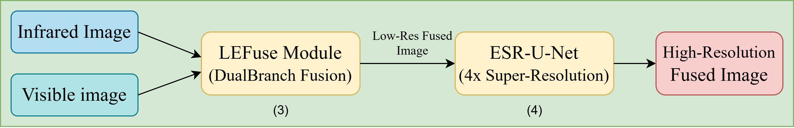
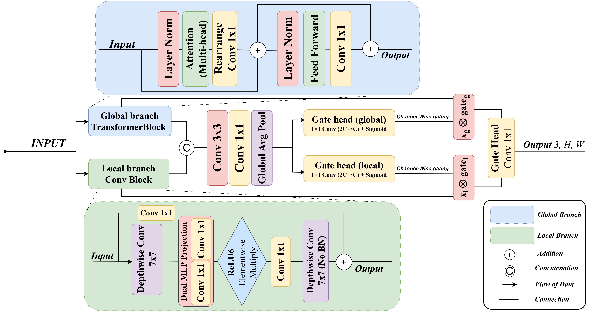
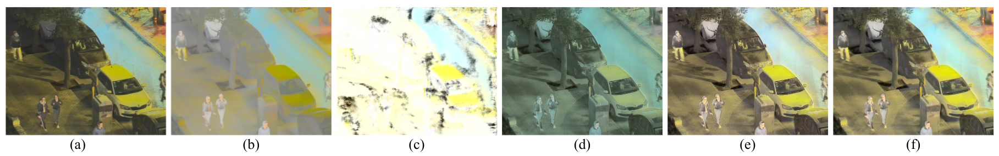

# FGRE-Fuse: A Joint Fusion-Guided Super-Resolution Framework for Low-Light Infrared and Visible Image Fusion

📰 **Publication Status**: This work has been submitted to *Computer Vision and Image Understanding* (Elsevier).

> **FGRE-Fuse** addresses a core challenge in nighttime imaging: when infrared and visible source images are low-resolution, cascading a pre-trained super-resolution model after fusion introduces artifacts and attenuates thermal signatures due to domain mismatch. We solve this with a **fusion-guided training paradigm** that eliminates the need for external high-resolution ground truth entirely.

---

## 🌟 Highlights

- 🔁 **No External HR Ground Truth Required** — The fused image itself serves as supervision, generating intrinsically aligned LR-HR training pairs via bicubic downsampling.
- 🌿 **Dual-Branch Fusion** — Parallel Global Context Path (Transformer-based) and Local Texture Path (CNN-based) adaptively integrate thermal saliency and visible texture.
- 🔬 **ESR-U-Net DRA** — Enhanced Super-Resolution U-Net with Dual Refinement Attention performs 4× upscaling using stacked Reversed U-Blocks and multi-scale attention.
- 🎯 **Downstream Task Boost** — Improved YOLOv5 object detection mAP@0.5 on M3FD nighttime dataset over all baselines.
- ⚡ **Computationally Efficient** — 174 GFLOPs, achieving 8.7% lower cost than LEFuse and 95% lower than DIVFusion.

---

## 📐 Architecture Overview



*Fig. 1: Overall architecture of FGRE-Fuse. The dual-branch fusion module integrates IR and VIS inputs. The resulting HR fused image is downsampled to create LR-HR pairs for training the ESR-U-Net DRA, which performs 4× super-resolution.*

The framework operates in two stages:

1. **Fusion Stage** — Co-registered infrared and visible images are fused via the Dual-Branch Adaptive Fusion Module.
2. **Super-Resolution Stage** — The fused output is upsampled 4× using the ESR-U-Net DRA trained on self-generated, domain-aligned LR-HR pairs.

---

## 🏗️ Core Components

### A. Dual-Branch Adaptive Fusion Module



*Fig. 2: Dual-Branch Module showing the Global Context Path (GCP) and Local Texture Path (LTP).*

| Branch | Mechanism | Purpose |
|---|---|---|
| **Global Context Path (GCP)** | Multi-head self-attention (Transformer) | Long-range thermal dependencies, structural consistency |
| **Local Texture Path (LTP)** | Depthwise separable convolution (7×7 kernel) | High-frequency texture, edge detail from visible modality |
| **Adaptive Recalibration** | Channel-spatial gating with sigmoid | Dynamically balances contributions of both branches |

The fused feature representation is computed as:

```
F_fused = F0 + Fl ⊙ wl + Fg ⊙ wg
```

where `wl` and `wg` are learned adaptive weight maps, and `⊙` denotes element-wise multiplication.

---

### B. Enhanced Super-Resolution U-Net with Dual Refinement Attention (ESR-U-Net DRA)


*Fig. 3: Architecture of the ESR-U-Net DRA.*

The SR module comprises:
- **Feature Extraction Head** with Enhanced Channel Attention (ECA)
- **3× Stacked Reversed U-Blocks (RUBs)** — each expands spatially via pixel-shuffle, applies Multi-Scale Attention Aggregation (MSAA) with 3×3, 5×5, 7×7 parallel convolutions, then contracts
- **Multi-Stage Feature Aggregation** via weighted fusion of all RUB outputs
- **Global Residual Learning** — bicubically upsampled input added to network output to preserve low-frequency content

Final output:
```
I_f^HR = R(F_final) + BicubicUp(I_f^LR)
```

---

### C. Fusion-Guided Training Paradigm

The key insight: **use the fused image as its own supervisor**.

```
I_HR^fused = F_fusion(I_IR, I_VIS)  ∈ ℝ^{1024×1024}
I_LR^fused = BicubicDownsample(I_HR^fused, s=4)  ∈ ℝ^{256×256×3}
```

This creates LR-HR pairs that are perfectly aligned with the fused domain — no manual annotation, no domain mismatch.

---

## ⚙️ Installation

### Prerequisites
- Python 3.8+
- PyTorch 1.13+ with CUDA support
- NVIDIA GPU (tested on RTX 4090, 16 GB RAM)

### Setup

```bash
git clone https://github.com/Aneeskhalil/FGRE-Fuse.git
cd FGRE-Fuse
pip install -r requirements.txt
```

---

## 🗂️ Datasets

| Dataset | Pairs | Resolution | Scene |
|---|---|---|---|
| [LLVIP](https://bupt-ai-cz.github.io/LLVIP/) | 16,836 | 1024×1024 | Nighttime pedestrian |
| [TNO](https://figshare.com/articles/dataset/TNO_Image_Fusion_Dataset/1008029) | 261 | Various | Multi-scene military/civilian |
| [M3FD](https://github.com/JinyuanLiu-CV/TarDAL) | 4,200 | Various | Multi-illumination driving |

Training is performed on the LLVIP training set (14,028 pairs). Evaluation covers all three datasets without dataset-specific fine-tuning.

---

## 🏋️ Training

```bash
python train.py \
  --dataset LLVIP \
  --epochs 100 \
  --batch_size 2 \
  --lr 1e-4 \
  --scale 4
```

### Key Training Details

| Setting | Value |
|---|---|
| Optimizer | Adam |
| Initial LR | 1×10⁻⁴ |
| LR Scheduler | Cosine Annealing (min: 1×10⁻⁶) |
| Epochs | 100 (early stopping, patience=10) |
| Batch Size | 2 |
| Gradient Clipping | max norm 0.5 |
| Augmentation | Random horizontal flip + 90° rotation |

### Loss Function

```
L_total = L_L1 + 0.05 · L_perceptual + 0.1 · L_color + 0.02 · L_gradient
```

- **L1 Loss** — pixel-wise accuracy, stable convergence
- **Perceptual Loss** — VGG-19 features (conv3_4, conv4_4, conv5_4) for semantic texture
- **Color Loss** — YCbCr chrominance channels to prevent color shift
- **Gradient Loss** — Sobel-filtered edge sharpness

---

## 🧪 Inference

```bash
python test.py \
  --checkpoint checkpoints/best_model.pth \
  --ir_path path/to/infrared \
  --vis_path path/to/visible \
  --scale 4 \
  --output_dir results/
```

---

## 📊 Quantitative Results

### Fusion Performance (LLVIP — Loss Ablation)

| Config | EN↑ | SD↑ | SF↑ | AG↑ | NIQE↓ | VIF↑ |
|---|---|---|---|---|---|---|
| Baseline | 7.65 | 53.18 | 26.63 | 7.75 | 3.33 | 0.95 |
| **FGRE-Fuse** | **7.79** | **63.82** | 21.91 | **15.81** | **2.55** | 0.92 |

### Fusion vs. SOTA — M3FD Dataset

| Method | EN↑ | SD↑ | SF↑ | VIF↑ | NIQE↓ | AG↑ |
|---|---|---|---|---|---|---|
| GANMcC | 6.64 | 32.67 | 8.26 | 0.55 | 4.67 | 2.87 |
| DIVFusion | 7.63 | 55.26 | 17.23 | 0.69 | 3.48 | 5.45 |
| LEFuse | 7.48 | 51.86 | 23.84 | 0.83 | 4.41 | 7.91 |
| **FGRE-Fuse** | 7.44 | **53.20** | **26.04** | **0.92** | **2.57** | **10.05** |

### Super-Resolution vs. Cascaded Pipelines — LLVIP

| Method | PSNR↑ | SSIM↑ | PSNR vs PGT↑ | SSIM vs PGT↑ | AG↑ |
|---|---|---|---|---|---|
| LEFuse + ESRGAN | 22.529 | 0.671 | 23.156 | 0.673 | 6.519 |
| LEFuse + SwinIR | 28.268 | 0.814 | 22.843 | 0.682 | 6.509 |
| DIDFuse + Bicubic | 31.175 | 0.836 | 22.575 | 0.890 | 3.310 |
| **FGRE-Fuse** | **32.498** | **0.961** | **26.185** | **0.892** | **6.633** |

### Joint Fusion + SR vs. SOTA — M3FD & TNO

| Method | M3FD SSIM↑ | M3FD Qabf↑ | TNO SSIM↑ | TNO Qabf↑ |
|---|---|---|---|---|
| MetaLearning | 0.283 | 0.137 | 0.280 | 0.140 |
| SaDiff | 0.435 | 0.178 | 0.250 | 0.180 |
| **FGRE-Fuse** | **0.651** | **0.381** | **0.780** | **0.340** |

### Downstream Object Detection — M3FD (YOLOv5)

| Method | P↑ | R↑ | mAP@0.5↑ | mAP@0.5:0.95↑ |
|---|---|---|---|---|
| GANMcC | 0.854 | 0.733 | 0.787 | 0.483 |
| DIDFuse | 0.871 | 0.718 | 0.791 | 0.491 |
| LENFusion | 0.875 | 0.709 | 0.780 | 0.476 |
| **FGRE-Fuse (4×)** | **0.877** | **0.737** | **0.798** | **0.492** |

### Computational Efficiency

| Method | FLOPs (GFLOPs) |
|---|---|
| **FGRE-Fuse** | **174.00** |
| LEFuse | 189.10 |
| U2Fusion | 202.36 |
| RFN-Nest | 520.81 |
| LENFusion | 669.05 |
| DIVFusion | 3386.93 |

---

## 🔬 Ablation Study



*Fig. 4: Visual comparison of FGRE-Fuse variants (a–e) against the full model (f). Progressive removal of modules demonstrates the necessity of each proposed component.*

| Variant | EN↑ | AG↑ | SSIM↑ | Qabf↑ |
|---|---|---|---|---|
| A: Global-Branch OFF | 7.07 | 3.32 | 0.89 | 0.36 |
| B: Local-Branch OFF | 5.13 | 2.05 | 0.61 | 0.03 |
| C: SE-OFF | 4.03 | 1.03 | 0.43 | 0.06 |
| D: Channel-Attention OFF | 6.09 | 2.08 | 0.84 | 0.28 |
| E: RDB Bypassed | 7.55 | 1.10 | 0.81 | 0.34 |
| **F: Full Model** | **7.65** | **5.03** | **0.98** | **0.37** |

The most critical component is the **SE adaptive recalibration** (variant C), whose removal causes the largest collapse in SSIM (0.98 → 0.43), confirming that dynamic branch weighting is essential for multimodal feature integration.

---

## 📋 Evaluation Metrics

| Metric | Description |
|---|---|
| **EN** (Entropy) | Information richness of fused image |
| **SD** (Standard Deviation) | Global contrast |
| **AG** (Average Gradient) | Edge sharpness and texture detail |
| **SF** (Spatial Frequency) | Overall spatial activity |
| **VIF** (Visual Information Fidelity) | Structural information preservation |
| **NIQE** | Perceptual naturalness (lower is better) |
| **PSNR / SSIM** | Full-reference reconstruction fidelity |
| **LPIPS** | Learned perceptual similarity |

---

## 📁 Repository Structure

```
FGRE-Fuse/
├── Diagrams/
│   ├── Diagram.jpg              # Overall architecture (Fig. 1)
│   ├── Dualbranch_fusion_module.png  # Dual-branch module (Fig. 2)
│   ├── SR-Module.png            # ESR-U-Net DRA (Fig. 3)
│   └── Ablation.png             # Ablation visual comparison (Fig. 4)
├── models/
│   ├── fusion_module.py         # Dual-branch adaptive fusion
│   ├── sr_module.py             # ESR-U-Net DRA
│   └── fgre_fuse.py             # Full pipeline
├── losses/
│   └── composite_loss.py        # L1 + Perceptual + Color + Gradient
├── train.py
├── test.py
├── requirements.txt
└── README.md
```

---

## ⚠️ Limitations

- **Degradation Model**: Training uses bicubic downsampling; real sensor degradation (noise, compression) may differ. Future work will explore high-order degradation pipelines.
- **Fixed Scale Factor**: Currently supports 4× only; arbitrary-scale SR is a planned extension.
- **Non-Real-Time**: Designed for quality-critical applications (surveillance, forensics, remote sensing) rather than edge deployment. Lightweight variants are under investigation.
- **Dataset Diversity**: Validation on controlled benchmarks; extreme conditions (fog, heavy rain) remain an open challenge.

---

## 🔭 Future Work

- Detector-aware fine-tuning to tighten the loop between SR quality and detection performance
- Flexible arbitrary-scale super-resolution support
- Lightweight architecture for drone and embedded deployment
- Real-world degradation modeling for unpaired sensor data

---

## 📄 Citation

If you find this work useful, please cite:

```bibtex
@article{khalil2025fgrefuse,
  title     = {FGRE-Fuse: A Joint Fusion-Guided Super-Resolution Framework for Low-Light Infrared and Visible Images Fusion},
  author    = {Khalil, Anees and Qi, Jin and Muhammad, Ahmad and Rafique, Hafiza Maria},
  journal   = {Computer Vision and Image Understanding},
  year      = {2025}
}
```

---

## 🙏 Acknowledgements

- LLVIP, TNO, and M3FD dataset providers
- PS-GAN authors for pseudo ground truth generation
- YOLOv5 team for downstream evaluation framework
- SRUNet authors whose reversed U-block design inspired ESR-U-Net DRA

---

## 📬 Contact

**Anees Khalil** — School of Information and Communication Engineering, UESTC, Chengdu, China  
🔗 GitHub: [https://github.com/Aneeskhalil/FGRE-Fuse](https://github.com/Aneeskhalil/FGRE-Fuse)

---

## 📜 License

This project is licensed under the MIT License — see the [LICENSE](LICENSE) file for details.
